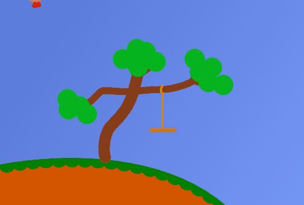
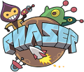

import TableOfContents from "../../components/TableOfContents";

Voici le premier article du *Devblog *du jeu que je suis en train de créer en ce moment et qui s’appelle **Chibiland **! Son site est ouvert [https://chibi.land/](https://chibi.land/) 😮 et le jeu est même déjà en phase d’alpha privée !

L’alpha est réservée au membre du serveur Discord du jeu donc n’hésitez pas à le rejoindre si vous voulez tester : [https://discord.gg/94KdGuU](https://www.youtube.com/redirect?event=video_description&v=w_uobFeTOVA&redir_token=QUFFLUhqazZHMXFpRGRNOWZmQUlOTHR1MHRjSzZCQW1fQXxBQ3Jtc0ttMVdvRXB6bkx1V2t3Y0c3enE3Z1BXSjJwamkwcXhSTklGYUw1YjNDOHIxRTN3cVkwdjYtSGZOMFVDeWFIRlZuWTNGdjdaQVBFLVZwNG1zc2NNRkpudGZWQVdMWUl1ZDg5OHVHRXVLdGtnU3hycnNOcw%3D%3D&q=https%3A%2F%2Fdiscord.gg%2F94KdGuU). Bien-sûr ne vous attendez pas à un truc incroyable pour le moment, pour le moment ce n’est vraiment que la base du jeu que j’ai en tête.

Dans cet article je vais vous présenter le projet et ses technologies.

<TableOfContents data={props}/>

## Présentation du projet

Chibiland est un jeu-vidéo de type **Tchat 2D Multijoueur** qui se veut simple, agréable et innovant.

L’objectif est que n’importe qui puisse commencer à jouer en un claquement de doigts et être pris dans le jeu directement. Ainsi pas de lourds fichiers à télécharger, d’application à installer ou de gros moteur de jeu à faire fonctionner. Place à la simplicité avec une Progressive Web App installable en un clic, des images légères en svg, et un moteur de jeu simple : Phaser, maintenu par son créateur aidé de sa communauté. Résister au leadership des Unity et développer mon jeu avec ce moteur est un moyen fort de soutenir ce développeur et de toujours garder mon objectif à l’esprit.

Je me suis lancé dans cette aventure car j’ai depuis longtemps envie d’avoir mon propre projet sur lequel je puisse passer mon temps et exercer ma passion, tout en apprenant plein de choses et en créant un univers de bienveillance.

Au départ j’avais très peu d’ambition avec ce projet. En fait l’idée de base était juste de recréer une version simplifiée de Blablaland très rapidement. J’avais donc réfléchi à toutes les technologies à utiliser pour aller le plus vite possible : Phaser pour le client (ça n’a pas changé), Node.JS pour le serveur, Socket.io pour faire le lien entre les deux et Firebase pour gérer les utilisateurs et la base de données.

Je n’avais vraiment pas été cherché très loin dans le concept, comme le prouvent ces premières images du jeu :

*Le design initial de Flamiche (à peine inspiré d’un autre jeu*)

Mais après avoir discuté avec un avocat je me suis rendu compte que ça allait poser des problèmes au niveau légal.

C’est à partir de là que je me suis demandé “*Pourquoi ne pas partir sur quelque chose de totalement différent et pousser le concept original encore plus loin ?*“

J’ai donc commencé à réfléchir à des nouvelles fonctionnalités pour rendre le jeu plus moderne et pour qu’il se distingue de ses concurrents :

* Un écran de jeu prenant toute la taille de l’écran, parce que c’est quand-même bête de devoir jouer sur une petite portion de la page. D’autant plus que cela facilite grandement l’adaptation du jeu à toute les tailles d’écran.

* Un système de scrolling, c’est-à-dire que la caméra se déplace en suivant le joueur, comme c’est aujourd’hui fait dans presque tous les jeux 2D où vous contrôler un personnage. Cela donne un aspect plus moderne au jeu tout en facilitant la création de la map. En effet pas besoin de s’embêter à trouver comment couper idéalement les maps, comment les relier entre elles ou comment bien gérer le passage d’une map à une autre.

* Un style de personnage totalement différent mais qui offre la possibilité de construire tout un système de vêtements autour de lui pour le rendre ultra personnalisable.

Au final je me suis complètement éloigné de Blablaland, ce qui est vraiment une bonne chose.

### Les technologies utilisées

### Client

Le client de jeu est fait avec des technologies web modernes, il utilise le moteur de jeu Phaser ainsi que PlanckJS pour gérer la physique.

Le langage principal utilisé pour le client est le [TypeScript](https://www.typescriptlang.org/). C’était important pour de moi de partir sur un langage strict tel que celui-ci afin de bien structurer mon code et qu’il ne devienne pas un ramassis de n’importe quoi comme ça peut très vite être le cas en utilisant du JavaScript simple.

J’ai choisi d’utiliser le moteur de jeu [Phaser](https://phaser.io/) car c’est le moteur web le plus populaire et car il est en accord avec mes motivations ; Il est libre, simple à utiliser tout en proposant beaucoup de fonctionnalités et il permet de créer des jeux légers très facilement.

Pour le moteur physique j’avais initialement choisi de partir sur Matter.js, cependant ce moteur a deux gros défauts :

1. Il a beaucoup de problèmes ; il ne possède notamment pas de *Continuous Collision Detection*.

1. Il n’existe pas de version Java de ce moteur, ce qui aurait posé problème vis-à-vis du serveur.

Au final le moteur physique pour lequel j’ai opté est [Planck.js](https://piqnt.com/planck.js/), un portage de Box2D en JavaScript, donc une valeur sûre en somme.

### Serveur

Le serveur de jeu est fait en Java, principalement car c’est mon langage de prédilection, mais aussi parce que c’est une bonne technologie qui reste très performante. Elle est utilisée par les serveurs de Minecraft, et bientôt d’Hytale.

### Site web

Côté site web je suis parti sur du Python. Si j’ai choisi ce langage c’est non pas parce que je le maîtrise (car en réalité je suis vraiment pas très bon en Python 😅), mais plutôt pour le framework [Django](https://www.djangoproject.com/) !

En effet ce framework est juste excellent pour faire des sites web facilement et **sécurisés**. J’avais déjà eu l’occasion de toucher à Symfony et Django dans le passé donc le choix se portait à la base entre ces deux là, mais Django est clairement plus compréhensible et simple à utiliser que Symfony. Malgré mes lacunes en Python il me fera très certainement gagner beaucoup de temps.

Voilà donc pour ce qui est de ce premier article du Devblog !

A bientôt pour le prochain article ! Celui-ci devrait porter sur les autres outils utilisés pour le développement du jeu.
