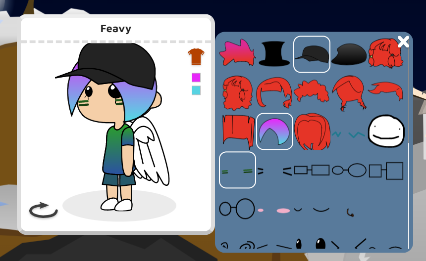
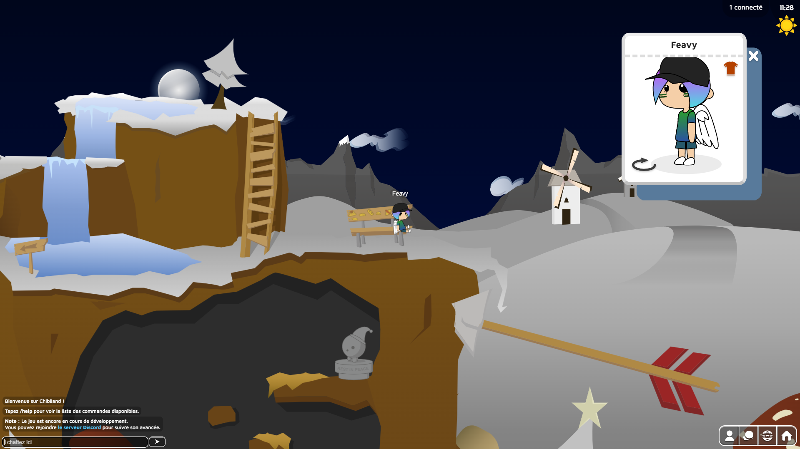
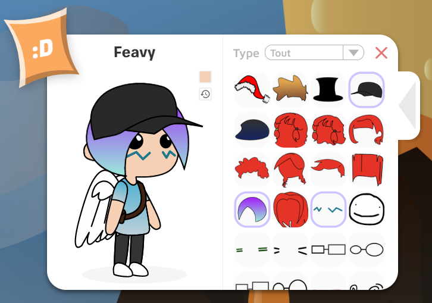
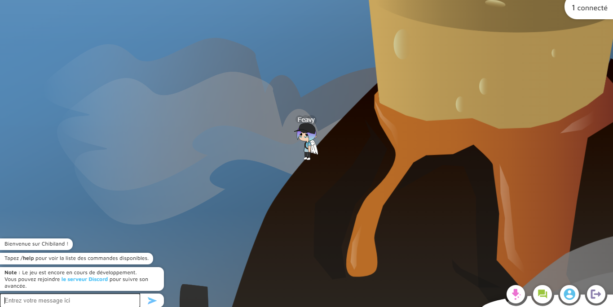

Hello 👋

J’ai décidé de (re)lancer un devblog au rythme d’un article par mois pour vous tenir informés de l’avancée du projet 😃

Ces articles seront volontairement techniques par endroits, j’espère toutefois qu’ils resteront digestes pour les lecteurs qui ne sont pas dans le monde de l’informatique 😃

En Août 2020 j’ai publié un premier article du devblog pour présenter le projet et les technologies utilisées : [https://blog.feavy.fr/devblog-chibiland-1-presentation-et-technologies/](https://blog.feavy.fr/devblog-chibiland-1-presentation-et-technologies/)

En Juin 2021 j’ai commencé à rédiger un article pour parler de la refonte du projet que j’étais en train de faire : [https://blog.feavy.fr/wip-devblog-chibiland-2-le-passage-de-django-a-quarkus/](https://blog.feavy.fr/wip-devblog-chibiland-2-le-passage-de-django-a-quarkus/) (il est encore à l’état de brouillon, peut-être que j’aurais la foi de le terminer un jour).

On arrive maintenant à l’été d’une nouvelle année et donc à… une nouvelle refonte du projet ! 😂

En effet ce projet est vraiment pour moi un moyen de m’amuser et découvrir plein de choses et donc, à mesure que j’apprends et que j’ai de nouvelles idées, je cherche naturellement à les mettre en pratique sur ce projet.

C’est passé dernièrement par…

## La refonte de l’interface du jeu

J’avais fait la première version de l’interface sans trop y réfléchir et ça se voyait. On ne peut pas dire que ça ait été une réussite d’un point de vue esthétique 😬 et je trouvais que ça faisait tache à côté des belles maps de Zephyra 🥺

J’ai donc décidé de la revoir. Ma première idée était d’utiliser un pack de composants UI tout prêt tel que :

<LinkPreview caption="" url="https://assetstore.unity.com/packages/2d/gui/cartoon-gui-pack-48850"/>

Mais ça n’a pas vraiment plu au reste de l’équipe ; trop cartoon, trop style jeu mobile classique. Le jeu aurait perdu de son identité.

Alors on a réfléchi à un design d’interface personnel dans l’esprit de Chibiland.

Et c’est ainsi que je suis parti sur un design très épuré, blanc, qui met plus en valeur l’interface et les textes.

La carte de joueur a aussi été refaite pour se rapprocher du style de Club Penguin.

### AVANT

### APRÈS

Cette refonte représente aussi une grande avancée d’un point de vue technique avec le passage au framework web [SolidJS](https://www.solidjs.com/) pour faciliter le développement de l’interface. Auparavant je manipulais le DOM en JavaScript vanilla, c’était pas beau à voir 💀

Cela m’a permis d’aisément corriger bon nombre de bugs et d’ajouter nouvelles fonctionnalités :

* Annulation des changements en cours.

* Remise par défaut des couleurs d’un vêtement.

* Filtre sur les vêtements.
