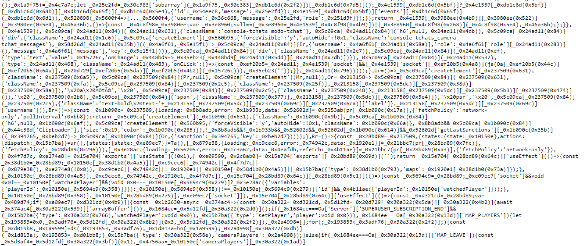
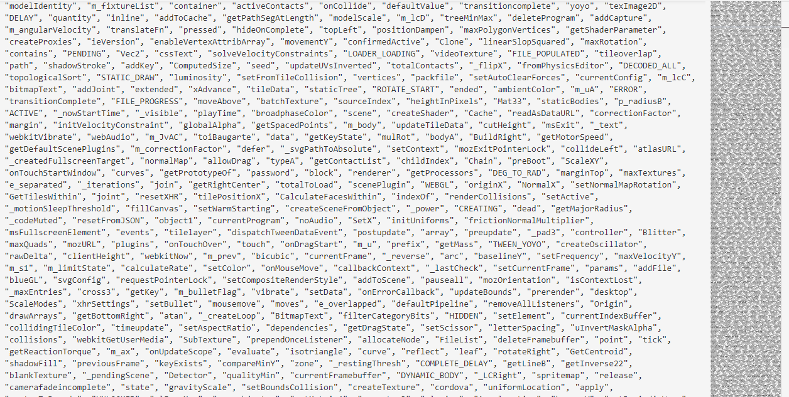

Petit article un peu hors-série pour parler de l’offuscation JavaScript car je trouvais ce sujet intéressant. 

Attention cet article-là est technique 🧑‍💻

Cela fait un moment que [l’offuscateur JavaScript que j’utilisais](https://github.com/javascript-obfuscator/javascript-obfuscator) m’embêtait (pour ne pas dire un mot plus vulgaire).

En fait dans sa configuration la moins brutale on se retrouve avec ce genre de choses en sortie :



A première vue le code est difficile à comprendre ; chaque propriété est remplacée par une chaîne aléatoire à base d’hexadécimal… Cependant, dans cette configuration l’offuscateur conserve la correspondance entre ces chaînes aléatoires et leur valeur initiale pour ne pas casser le code.

Par exemple on aura :

```javascript
const player = {username: "Flamiche"};
```

Qui deviendra :

```javascript
const a = {"0x5fd5a": "Flamiche"};

// Avec quelque part la correspondance :
"0x5fd5a" -> "username"
```

Ce qui signifie que techniquement le processus est réversible !

Et en effet avec un script à base d’[eval](https://developer.mozilla.org/fr/docs/Web/JavaScript/Reference/Global_Objects/eval) de ce style, il est possible de remettre les chaînes originale à leur place et retrouver un code proche de celui en sortie de minimisation.

<LinkPreview caption="" url="https://gist.github.com/Feavy/628913854683fcb396649401eeb2137e"/>

Au final cette offuscation devient presque contre-productive car elle impacte négativement les performances et alourdit les fichiers sans pour autant rendre le code plus compliqué à comprendre vu que le processus peut être inversé.

Finalement ça ne fait plus qu’office de barrière à l’entrée.

Mais ça c’est pour la version “soft”.

Car en effet, en activant certaines options il y a possibilité de vraiment renommer les propriétés sans garder les originales ! Cela se fait via les options `renameProperties` et `renameGlobals`

Mais les utiliser sans casser le code est compliqué.

Pour les utiliser sans (trop de) problème avec Chibiland j’étais obligé de maintenir un [fork du projet](https://github.com/Feavy/javascript-obfuscator-1/) car il fallait parvenir à renommer toutes les propriétés du jeu **mais pas celles du moteur Phaser (et autres bibliothèques)**, sinon le lien entre les sources ***vendor*** et les sources du jeu serait perdu.

L’offuscateur propose une option `reservedNames` pour pallier ce problème. Comme son nom l’indique elle permet de réserver des noms de propriétés à ne pas modifier.

Cependant cette propriété prend comme valeur une liste de **RegExp **que les propriétés à conserver doivent matcher. Or avec les bibliothèques que j’utilise ça fait plus de 6000 noms de propriétés réservés… donc 6000 RegExp à tester !

C’était extrêmement coûteux et en pratique ça n’allait jamais jusqu’au bout.



Ce fork [ajoutait donc une option (exactReservedNames)](https://github.com/Feavy/javascript-obfuscator-1/commit/e45a6bb37a163d3655c7ea6d4f3ad33206c9b9b7) pour ignorer des propriétés précises **sans utiliser de RegExp**, ce qui permettait de tester toutes les propriétés du jeu en un temps raisonnable.

Mais Chibiland possède lui aussi son lot de mots réservés. Et donc avant chaque mise en production, le jeu était cassé et je devais deviner les nouveaux mots réservés à ajouter jusqu’à temps qu’il fonctionne à nouveau… C’était assez fastidieux.

Et avec le passage à SolidJS cela aurait ajouté encore plein de mots réservés à trouver… j’avais la flemme.

Alors j’ai pris le problème dans le sens inverse.

Plutôt que donner une liste de mots réservés, pourquoi ne pas donner une liste de mots à masquer?

C’est ce que j’ai fait avec le “Chibi Obfuscator”, un plugin WebPack tout bête qui fait du search-and-replace à travers le code en sortie de compilation, afin de masquer certaines propriétés.

Le procédé reste encore très artisanal avec le besoin d’énumérer toutes les propriétés à masquer. L’idéal serait de pouvoir les trouver automatiquement dans le code source mais je n’ai pas encore eu l’occasion de me pencher là-dessus (ça pourrait se faire facilement avec ts-node).

Avec tout ça je ne sais même plus si c’est vraiment utile d’offusquer le code avec l’outil dont je vous ai parlé, je vais le laisser pour l’instant, par acquis de conscience, mais je pencherai plus en profondeur sur la question dans le futur.

Voilà pour ce qui est de l’offuscation. C’est peut-être pas très judicieux de parler de cet aspect de sécurité dans un article mais je tenais à le faire car ce sujet m’intéresse beaucoup.

J’ai souvent été de l’autre côté de la barrière, à essayer de comprendre du code offusqué, notamment pour des jeux Flash comme DarkOrbit :

<LinkPreview url="https://github.com/Feavy/darkorbit_preloader"/>

<LinkPreview url="https://github.com/Feavy/Darkorbit-main.swf-decrypter"/>

Pour Flash l’offuscation était quand-même beaucoup plus pertinente car les sources étant compilées en bytecode, leur décompilation et analyse dépendait de la qualité des décompilateurs à disposition. Le processus était rendu bien plus difficile que pour JavaScript où tous les outils de debug nécessaires sont intégrés directement dans le navigateur et où il est même possible d’interagir avec le code en temps réel.

JavaScript est par nature un langage dont on ne peut pas masquer les algorithmes, la seule chose que l’on peut faire est de les rendre plus compliqués à comprendre. Mais avec le temps suffisant il sera toujours possible de retrouver les originaux.

C’est pourquoi utiliser l’offuscation pour empêcher la triche dans un jeu web multijoueur est une fausse solution, si la triche doit être bloquée quelque part, c’est côté serveur que ça doit se passer.

Cela évoluera peut-être dans le futur avec la popularisation de WebAssembly, qui ne permet pas de retrouver le code source après compilation. C’est d’ailleurs une des raisons qui m’avait poussé à créer le Cherry Engine, un moteur de jeu web C++.

Mais pour en savoir plus il faudra lire l’article suivant 😉


**Suite :**

[Devblog Chibiland #5 — De Phaser vers le Chibi Engine](/articles/devblog-chibiland-5-de-phaser-vers-le-chibi-engine)

Page not found 23835940-46b0-445d-8dc3-74a45065838f

