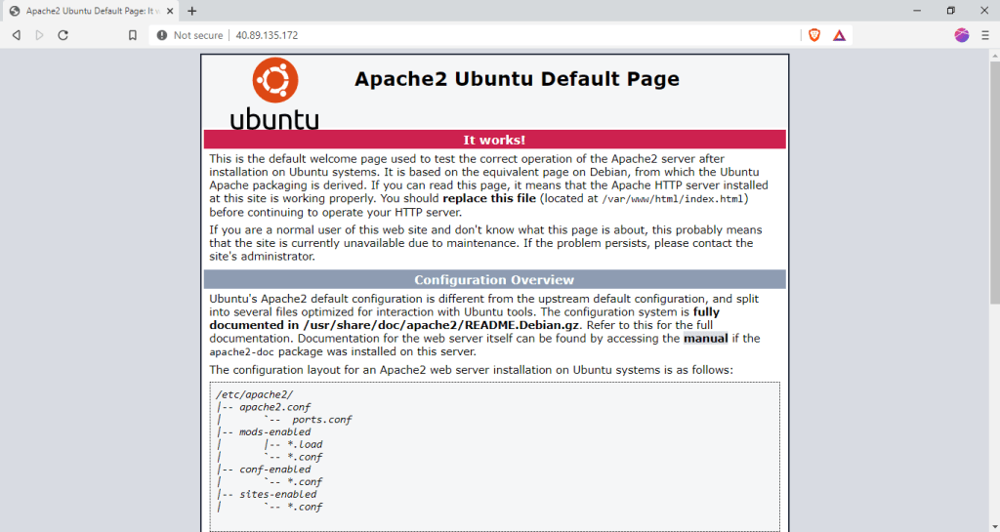
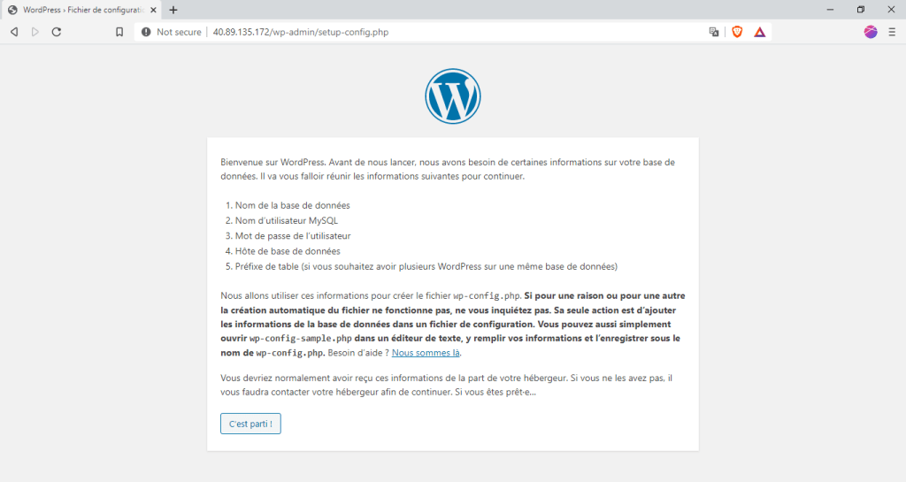
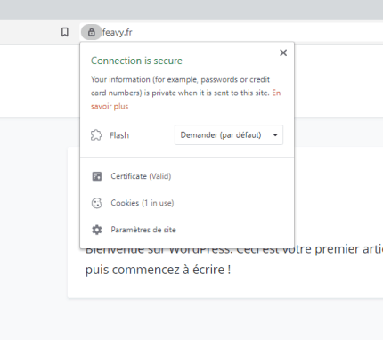
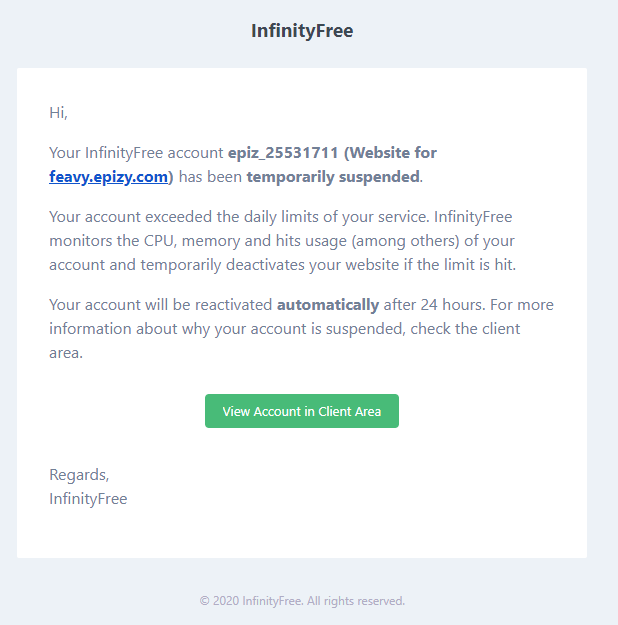

import TableOfContents from "../../components/TableOfContents";


Jusqu’à présent mon site [feavy.fr](http://feavy.fr/) était hébergé sur [Planethoster](https://www.planethoster.com/fr/). J’avais choisi cet hébergeur car il propose une offre gratuite et possède des serveurs en France contrairement aux autres hébergeurs gratuits que j’ai pu voir.

Sauf que très récemment mon hébergement a succombé sous les problèmes techniques, RIP petit site ? Dieu merci j’ai pu sauver la base de données vide, c’est déjà ça. Heureusement je ne comptais de toute façon pas rester chez eux car l’offre gratuite se désactive automatiquement tous les mois et donc on est obligé de la réactiver sans cesse ce qui est vite embêtant.

Je suis donc passé temporairement sur [Infinity Free](https://infinityfree.net/) parce que je n’allais quand-même pas payer pour héberger mon site personnel non mais oh ! Ça soulevait cependant un problème : le site n’était pas hébergé en France (mais au Royaume-Uni) donc ça ralentissait le temps d’accès au site pour les français (donc sûrement vous). Et comme je suis du genre perfectionniste ça m’a dérangé ?

C’est la qu’intervient ce tuto !! Puisque dans celui-ci on va voir la solution que j’ai mise en place pour palier ce problème, à savoir utiliser Microsoft Azure pour héberger un site WordPress et, en tant qu’étudiant, [bénéficier des services gratuits et des 100$ offerts qu’on a pour avoir cet hébergement gratos](https://azure.microsoft.com/fr-fr/free/students/). *Prolo approved !*

<div class="columns">
<div class="column column-icon">

<div class="notion-image" style="width: 118px; height: 118px;">


</div>

</div>
<div class="column">

Attention, je tiens à préciser que cette technique n’est avantageuse **que si vous êtes étudiants**. Si ce n’est pas le cas vous allez vous retrouver à payer un prix excessif pour un simple site WordPress.

</div>
</div>

Voici les étapes que nous allons suivre :

<TableOfContents data={props}/>

## Installation de la VM

*Pour cette étape je suppose qu*e* vous possédez déjà un compte Microsoft Azure, si ce n’est pas le cas créez-en un.*

Commençons donc par mettre en place la VM sur Microsoft Azure. Pour cela nous allons simplement nous rendre dans la section *Machin*es *Virtuell*es et cliquer sur *Ajouter*.

Il faut ensuite préciser plusieurs informations :

* Abonnement : laissez *Azure pour les étudiants*.

* Groupe de ressources : créez-en un nouveau, pour ma part je vais l’appeler *WordPress*.

* Nom de la machine virtuelle : *FeavyFR* chez moi.

* Région : *France-Centre *pour avoir le meilleur temps de réponse en France.

* Image : je vous recommande un serveur Ubuntu, ce sera la version *18.04 LTS* pour moi.

* Taille : ici il faut choisir *B1s* car les étudiants ont 750h gratuites avec lui.

* Type d’authentification : comme vous voulez, pour moi ce sera par *Mot de passe*.

* Ports d’entrée : *22, 80, 443*.

Vous pouvez laisser les autres parties inchangées. A noter qu’on vous demandera peut-être de créer un compte de diagnostic.

Vous pouvez ensuite lancer le déploiement et attendre qu’il se termine…

<div class="columns">
<div class="column column-icon">

<div class="notion-image" style="width: 118px; height: 118px;">


</div>

</div>
<div class="column">

**Quelques informations sur la VM B1s**

Celle-ci possède 1 processeur et 1 Go de RAM, ce qui est largement suffisant pour héberger un site WordPress. Elle possède cependant 320 entrées/sorties maximales par seconde ce qui, je pense, risque de ralentir un site avec beaucoup de trafic.

Au niveau du coût on est sur du 7.39 € / mois ce qui fait 81.29 € au total pour un an (en comptant le mois gratuit). Il faut donc prévoir au moins 81.29 crédits sur les 100 offerts pour héberger ce site.

</div>
</div>

Une fois que c’est terminé accédez à la ressource et éteignez la VM, choisissez bien que vous voulez **conserver son adresse IP**. Allez ensuite dans *Disques*, cliquez sur votre disque puis allez dans *configuration *et saisissez une taille de *64 Go* pour ce disque. Cela va avoir pour effet de le transformer en disque *p6*, ce qui va non seulement augmenter sa taille, mais aussi vous permettre de **ne pas payer le stockage** car les étudiants ont droit à deux disques *p6 *offerts ?

Démarrez ensuite la VM et notez bien son adresse IP publique. Elle va nous permettre de nous connecter à cette dernière.

Depuis une mise à jour de Microsoft Azure vous êtes obligés d’utiliser une clé de chiffrement pour vous connecter en ssh à une VM. Nous allons donc créer ces clés.

Dans un terminal entrez la commande suivante et laissez les *passphrase *vides :

```bash
ssh-keygen -t rsa -b 2048 -f vm_key
```

Cela va vous créer deux fichiers : *vm_key *(votre clé privée) et *vm_key.pub* (votre clé publique).

Il faut maintenant envoyer la clé publique sur la VM :

```bash
scp vm_key.pub [login]@[IP de la VM]:
```

Après ça vous pouvez vous connecter à la VM en utilisant votre clé privée :

```bash
ssh -i vm_key [login]@[IP de la VM]
```

*Bingo !*


## Installation du serveur web (LAMP)

Maintenant que vous êtes connectés, en accord avec [la documentation](https://doc.ubuntu-fr.org/lamp), vous pouvez installer LAMP grâce à la commande suivante :

```bash
sudo apt install apache2 php libapache2-mod-php mysql-server php-mysql
```

La documentation recommande également d’installer les modules PHP usuels pour que les CMS fonctionnent correctement :

```bash
sudo apt install php-curl php-gd php-intl php-json php-mbstring php-xml php-zip
```

Vous pouvez dès présent vérifier que votre serveur web fonctionne bien en entrant l’IP publique de votre VM dans un navigateur :

*La page de bienvenue d’Apache s’affiche : le serveur web est opérationnel !*



Nous allons maintenant initialiser la base de données MySQL. Pour cela entrez la commande suivante :

```bash
sudo mysql_secure_installation
```

C’est ici que vous pourrez configurer les options de sécurité de votre base de données. On vous demande en premier lieu si vous souhaitez configurer le plugin *Validate Password* (Validation des mots de passe) ; cela permet de tester que les mots de passe entrés sont suffisamment forts.

On vous demandera ensuite de définir un mot de passe pour l’utilisateur **root**, retenez bien ce mot de passe, vous en aurez besoin.

Ensuite je vous conseille d’accepter tous les autres changements car cela permettra à votre base de données d’être plus sécurisée (notamment en l’empêchant d’être accessible depuis l’extérieur).

## Installation de WordPress

Pour commencer nous allons créer la base de données MySQL nécessaire à WordPress.

On se connecte à MySQL en **root** (entrez le mot de passe défini précédemment) :

```bash
sudo mysql -u root -p
```

Puis on exécute les requêtes suivantes pour créer la base de données *wordpress* :

```sql
mysql> CREATE DATABASE wordpress;
Query OK, 1 row affected (0.00 sec)
mysql> COMMIT;
Query OK, 0 rows affected (0.00 sec)
mysql> exit
Bye
```

Maintenant on peut installer WordPress à proprement dit. Pour cela il suffit de le télécharger et de le déplacer dans le répertoire *html* d’apache (/var/www/html) :

```bash
curl --output wordpress.zip https://fr.wordpress.org/latest-fr_FR.zip
sudo unzip wordpress.zip -d /var/www/html
sudo mv /var/www/html/wordpress/* /var/www/html
```

On supprime ensuite l’index par défaut d’Apache pour que celui de WordPress soit pris en compte :

```bash
sudo rm /var/www/html/index.html
```

Maintenant il ne reste plus qu’à configurer les permissions pour qu’Apache ait tous les droits sur ce répertoire et donc que WordPress puisse fonctionner correctement :

```bash
sudo chown www-data -R /var/www
sudo chmod 700 -R /var/www
```

Parfait. Maintenant en entrant l’IP publique de la VM vous devriez voir la page d’installation de WordPress :



Je vous laisse donc installer WordPress. Notez la configuration de la base de données :

* Utilisateur : root

* Mot de passe : *celui que vous avez défini*

* Base de données : wordpress

**Aparté : **Comment supprimer `index.php` de l’URL des permaliens de vos articles ?


Après avoir installé WordPress vous avez peut-être, comme moi, essayé de modifier les permaliens en supprimant *index.php* de ces derniers (parce que ça fait pas très beau on va pas se mentir), et vous vous êtes sûrement rendu compte qu’après ça, vos articles n’étaient plus accessibles. Ceci est dû au fait qu’apache n’est pas configuré pour lire le fichier *.htaccess* situé dans le répertoire d’installation de WordPress. Pour changer ça voici la marche à suivre :

Éditez le fichier */etc/apache2/apache2.conf* :

```bash
nano /etc/apache2/apache2.conf
```

Rajoutez-y le contenu suivant :

```
<Directory /var/www/html>
        Options FollowSymLinks
        AllowOverride All
</Directory>
```

Et voilà ! Les permaliens fonctionneront correctement à présent.

## Configuration d’un nom de domaine personnalisé

Pour cette étape rendez-vous dans le panneau de configuration DNS de l’autorité qui a enregistré votre nom de domaine. Vous devrez simplement y ajouter les enregistrement de type A suivants :

```
[votre domaine].        1   IN  A [IP publique de la VM]
www.[votre domaine].    1   IN  A [IP publique de la VM]
```

Patientez un peu le temps que les changements soient pris en compte. Votre site devrait ensuite être accessible directement en tapant votre nom de domaine. Si vous ne possédez pas de nom de domaine il existe [des sites](https://www.freenom.com/fr/index.html?lang=fr) qui vous en fournissent gratuitement.

## Installation d’un certificat SSL

Pour cette étape vous allez devoir entrer des commandes dans votre VM.

On commence par installer **Certbot**, un utilitaire permettant de déployer automatiquement des certificats SSL *Let’s Encrypt *:

```bash
sudo apt-get update
sudo apt-get install software-properties-common
sudo add-apt-repository universe
sudo add-apt-repository ppa:certbot/certbot
sudo apt-get update
```

On installe ensuite le plugin apache pour Certbot :

```bash
sudo apt-get install certbot python-certbot-apache
```

Et on lance la configuration SSL du serveur :

```bash
sudo certbot --apache
```

Dans cette étape vous devrez entre autres :

* Préciser l’adresse e-mail à utiliser pour recevoir les alertes de sécurité et de renouvellement du certificat.

* Indiquer vos domaines (par exemple *example.com* et* www.example.com*).

* Potentiellement choisir un *vhost* : choisissez le *000-default-le-ssl.conf* qui est configuré pour HTTPS.

* Indiquer si vous souhaitez rediriger le trafic HTTP vers HTTPS (je vous le recommande).

Et voila ! Votre site est maintenant sécurisé !



**Note : **maintenant que tout est configuré je vous conseille de fermer le port 22 de votre VM pour pas que le service SSH soit un point d’entrée pour de potentiels hackers.

Pour conclure, même si l’installation de WordPress est plus compliquée qu’avec les simples *one-click installers* proposés par les hébergeurs web, je trouve que ça vaut vraiment le coup ! Je suis très satisfait du résultat, en plus d’être totalement à niveau en terme de mises à jour, on a un contrôle total sur la machine et le site est bien plus rapide que ceux que j’ai pu avoir avec Infinity Free ou Planethoster !

On a les caractéristiques d’un bon hébergeur payant, avec notamment **plus de 60 Go de stockage en SSD**, et tout ça gratuitement ! Ça c’est cool ?

*Pour la petite anecdote, mon ancien site hébergé chez PlanetHoster s’est mis à fonctionner de nouveau. Vous pouvez le retrouver ici : *[*https://feavy.yo.fr/*](https://feavy.yo.fr/). *Notez que planetHoster reste une excellente solution si vous souhaitez héberger un site WordPress gratuitement. Il faudra juste penser à réactiver votre site tous les mois… et à contacter le support en cas de problème* ?

*Anecdote 2 : J’ai bien fait de partir d’Infinity Free, mon abonnement a été temporairement suspendu le jour-même où je suis passé à Microsoft Azure *?*, apparemment j’aurais dépassé le cota journalier **d’utilisation**… alors que j’ai à peine utilisé le site*.


