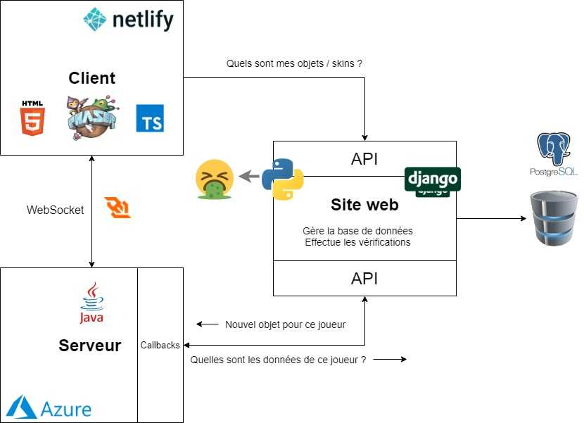
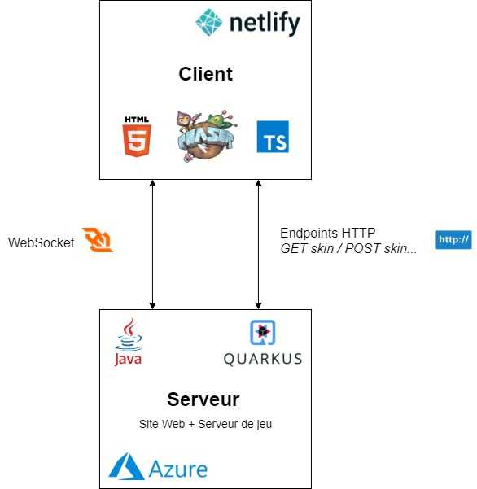

**Note : **Cet article est encore en cours d’élaboration (depuis plus d’un an 🤪)

<TableOfContents data={props}/>

## Problèmes actuels

* Le backend est trop compliqué.

* Serveur de jeu utilise une bibliothèque WebSocket bizarre qui marche mal avec Firefox.

* Site Web Django : pas d’uniformité avec le serveur de jeu.

* Pas d’accès direct à la BD depuis le serveur de jeu. Accès uniquement possible depuis Django → obligation de mettre en place des endpoints pour que le serveur de jeu puisse communiquer avec lui.
  * Parti d’une idée douteuse pour sécuriser la base de données.

* Communication entre site web et serveur de jeu difficile.

* Actuellement : backend “du bled”. Aucune automatisation de setup.

## Solution : Quarkus

**Fusionner le serveur web et le serveur WebSocket en un seul projet Quarkus qui gère tout.**

Avantages

* Même BD et repositories.

* Un seul système de rôles.

* Communication hyper simple entre le site web et le serveur de jeu.

* Meilleure organisation du projet web & facilité de développement.

* Hot reload.

* Déploiement plus rapide.

* Meilleure expérience développeur !

Inconvénients

* Obligation de recoder toutes les pages avec le nouveau template.

* Le projet risque d’être gros.

* Perte du forum Machina.

* Perte de l’interface d’administration autogénérée par Django.

* Perte de l’indépendance Site Web / Jeu.
  * Si le serveur de jeu crash le site sera inaccessible.
  * Un changement sur le site force un reload du jeu. (En demi-teinte : le site ne va pas évoluer souvent).

Solutions

* Soit recréer le système de forum manuellement.

* Soit intégrer un système de forum php (phpbb).

⇒ Faire deux projets Quarkus ?

* Comment partager les repositories et modèles ?
  * Créer une bibliothèque externe qui déclare les classes dont dépendent les deux projets.

* Comment communiquer entre les deux ?
  * ActiveMQ ?

A voir pour plus tard mais sûrement pas nécessaire.

### Mise en place

1. Commencer par un seul projet Quarkus pour plus de simplicité.
  1. Package game
  1. Package website

1. Convertir le serveur WebSocket en Quarkus.

1. Convertir le site web en Quarkus.
  1. Suppression du forum.
  1. Recréation des pages en template Qute.
  1. Gestion des utilisateurs et envoi de mails.

1. Fusionner les deux.

1. Mise en place du SSL.

1. Mise en place du déploiement continu avec Docker (et Kubernetes ?) pour automatiser le déploiement lors d’un commit sur master.
