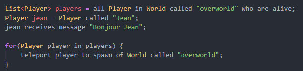

Cette page constitue des notes de réflexions sur une idée de paradigme de programmation orientée objet. Rien n’est structuré pour l’instant.

N’est-ce-pas bizarre que dans la bibliothèque Javacord on ait une méthode Channel#sendMessage. Littéralement ça veut dire “Le channel envoie un message”, hors il envoie rien du tout, c’est le serveur qui envoie le message au channel. Ce serait peut-être mieux appelé `channel.receiveMessage(“blabla”)` où là on lit “Le channel reçoit le message ‘blabla'”

Obtenir tous les joueurs en vie dans l’overworld ? facile `Player.all().in(World.called(“overworld”)).are(Player::alive);`

Ou même `Player.all().in(World.called(“overworld”)).are(alive);`

Par exemple `player.sendMessage(“Blabla”);` quelqu’un qui n’a jamais fait de programmation je pense qu’il comprend “Le joueur envoie le message “Blabla”, intuitivement



imaginons coder une nouvelle API pour serveur Minecraft. Un un joueur envoie un message dans le tchat. Pour écouter les messages le plus intuitif est :

```java
player.onReceiveMessage(msg ->
    //...
});

```

```java
player.onSendMessage(msg -> {
    //...
});

```

⇒ Plutot send

Et oui ! Ce serait encore plus bizarre de mélanger `player.sendMessage(…)` qui veut dire qu’on envoie un message au joueur et `player.onSendMessage` qui là par contre traite le cas où c’est le joueur qui envoie le message.

Et ça voudrait aussi dire que `player.sendMessage` n’appelle pas `player.onSendMessage` ! Alors que c’est littéralement on suivi du nom de la méthode.

⇒ Mais le fais de dire receive je pense que ça enduit d’ajouter un from

Si tu veux préciser le "from" y’a l’embarras du choix pour ça. Si on dit que "me" c’est le serveur :

```java
player.receiveMessage("blabla").from(server);
player.receiveMessage("blabla").fromServer()
player.receiveServerMessage("blabla");
player.receiveMessageFromServer("blabla");
player.receiveMessage(new ServerMessage("blabla"));

```

Après c’est vrai que `player.receiveMessageFromServer("blabla")` c’est pas une phrase correcte. Il faudrait `player.receiveMessage("blabla").fromServer()`

Le mieux ce serait d’introduire une nouvelle syntaxe pour définir des méthodes, genre

`public void receiveMessage(String message).fromServer()`

On pourrait même avoir

```java
public void receiveMessage(String message).from(MessageSender sender) {
    //...
}

```

Y’aurait limite plus besoin de commenter la méthode tellement c’est explicite, on aurait plus à se poser la question de si c’est `receiveMessage(String message, MessageSender sender)` ou `receiveMessage(MessageSender sender, String message)`

Autre idée de syntaxe

```java
public void receiveMessage(String message) {
    public void fromServer() {
        //...
    }
    public void fromPlayer(Player player) {
        //...
    }
}

```

Pour le coup ça peut se coder à peu près pareil en java

```java
public PlayerReceiveMessage receiveMessage(String message) {
    return new PlayerReceiveMessage() {
        public void fromServer() {
            //...
        }
        public void fromPlayer(Player player) {
            //...
        }
    }
}

```

Et en plus ça permettrait de déplacer tout le mécanisme de réception de message dans un fichier java à part !

Le soucis de la version Java par rapport à la première méthode est que le compilateur accepte `player.receiveMessage("blabla");` sans rien derrière. Et à la lecture on a l’impression qu’il reçoit un message mais en réalité il se passe rien.

Mais oui je suis d’accord qu’on devrait pas pouvoir faire `player.receiveMessage(...)` tout court mais malheureusement c’est pas possible d’empêcher ça en Java

le mieux ça reste peut-être

```java
player.receiveMessage(new ServerMessage("blabla"));

```

Ou on pourrait se servir de la surcharge pour faire une phrase plus correcte, mais ce serait moins explicite

```java
player.receive(new ServerMessage("blabla"));

```

Sinon ça c’est possible

```java
player.receiveMessage(new Message("blabla")); // Pas de from précisé donc on dit par défaut que le sender c'est le serveur
player.receiveMessage(new Message("blabla").fromServer()); // Si on veut on peut expliciter que le sender est le serveur mais cette instruction ne fera rien
player.receiveMessage(new Message("blabla").from(otherPlayer));
`
```

Imaginons maintenant que je souhaite donner un objet à un joueur, deux problèmes se posent alors :

1. La logique *Sentence* voudrait que j’écrive une instruction de la sorte :

```
player receives item apple

```

Ou bien

```
player receives apple

```

Cependant cela commence à entrer en collision avec le système de messages. En effet envoyer un message et donner un objet se disent avec des verbes différents, `send` et `give`. Mais dans les deux cas, côté joueur le verbe utilisé est le même "recevoir" `receive`.

1. Le second problème est la phrase que j’ai formulée : `Si je souhaite donner un objet à un joueur`

En effet c’est la manière la plus intuitive de formuler mais ça ne va pas avec la logique *Sentence* où on j’aurais dû dire `Si je veux qu'on joueur reçoive un objet`.

Mais en réalité peut-être que la première formulation peut fonctionner.

En effet ceci pourrait être une instruction correcte

```
give player apple
// Ou
give apple to player

```

Se pose la question de son implémentation en Java. On pourrait avoir quelque chose comme :

```java
public class Player {
    public static void give(Player receiver, Item item) {
        receiver.receiveItem(item);
    }
}

```

Qui permettrait, avec un import static, d’écrire :

```java
give(player, apple);

```

L’autre possibilité s’écrirait :

```java
public class Player {
    public static PlayerReceiveItem give(Item item) {
        return new PlayerReceiveItem() {
            public void to(Player player) {
                player.receivesItem(item);
            }
        }
    }
}

```

Permettant d’écrire :

```java
give(apple).to(player);

```

Le mieux serait peut-être de créer un langage spécifique intégrant cette syntaxe pour éviter de créer tous ces objets imbriqués.

```java
public class Player {
    public void give(this)item(Item item) {
       // Ajout de l'item
    }
}

```

On pourrait aussi y intégrer de l’auto-complétion. `player` ctrl espace nous proposerait `give player item`

Ces méthodes permettent d’écrire des instructions se rapprochant plus de phrases mais avec l’utilisation de Java se pose le problème de l’auto-complétion (+ documentation).

En effet quand on veut appliquer une méthode à un objet le plus intuitif est d’écrire `player` puis de faire ctrl espace pour voir les options proposées.

Autre possibilité :

```java
public class Give {
    public static GiveItem item(Item item) {
        return new GiveItem() {
            public void to(Player receiver) {
                receiver.receiveItem(item);
            }
        }
    }
}

```

Permet d’écrire :

```java
Give.item(apple).to(player);

```

Mais aurait-on également le réflexe de taper `Give` en premier pour **donner** un objet, et pas directement `player` ?

Vous remarquez qu’à chaque fois l’objet de la méthode est simplement d’appeler `player#receiveItem`. En réalité tout ça c’est que du sucre syntaxique pour ne pas pas écrire `player receives item` ->

La meilleure solution serait d’informer les utilisateurs du choix qui a été fait pour concevoir notre API, afin de leur indiquer de changer leur manière de penser, en se mettant à la place de l’objet qu’on considère. "Je suis un Joueur, je veux recevoir un objet". Au lieu d’avoir le regard extérieur du programmeur.
